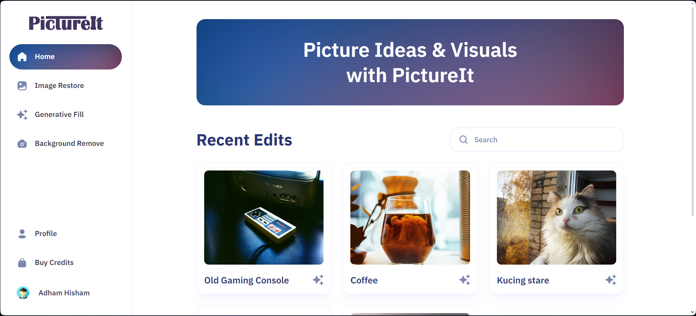

## About pictureit

A follow through tutorial to develop an AI image editor to be a Software as a Service (SaaS). Using severals platforms and techs like Cloudinary, Clerk, Stripe, shadcn/ui, Tailwind CSS, TypeScript, MongoDB. Just a personal learning project.



## Features

- Sign up/sign in using Clerk Authentication
- Utilize Cloudinary AI for image restoration, generative fill, and background removal
- Store all edited images for users to view or edit later
- Purchase tokens via Stripe with a few plan options

## Getting Started

First, run the development server:

```bash
npm run dev
# or
yarn dev
# or
pnpm dev
# or
bun dev
```

Open [http://localhost:3000](http://localhost:3000) with your browser to see the result.
